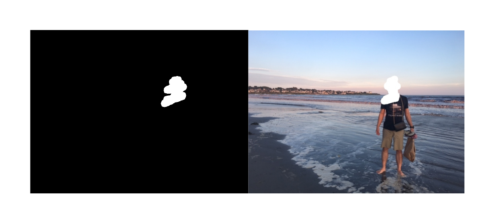
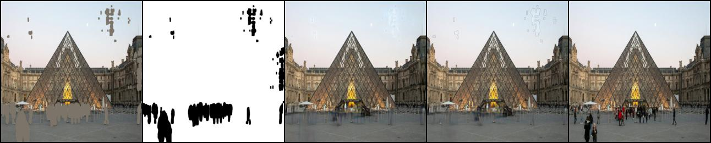

## EE 645 {3D-Computer Vision} Final Project

Contributors :
Harsh Patel - 18110062
Shivam Sahni - 18110159
Amey Kulkarni - 18110016
Udit Vyas - 18110176

The aim of this project is to perform image inpainting using robust deep learning methods that use partial convolution layers.

Please see the report for detailed understand of our work. \
This  project  is  inspired  from  the  original  paper:\

 `Image  Inpainting  for  Irregular  Holes  Using Partial  Convolutions`

- `G. Liu, F. A. Reda, K. J. Shih, T. Wang, A. Tao, and B. Catanzaro, “Image inpainting for irregular holes using partialconvolutions,”CoRR, vol. abs/1804.07723, 2018. [Online]. Available: http://arxiv.org/abs/1804.07723`

# Key files of the repository
## Back-end files
- ```train.py``` : To train a PConv Network that performs Image Inpainting.
- ```my_pconv.py``` : Contains the main Class Pconv
- ```my_unet``` : Contains the core architecture of the model - `PConvUNet`
## Application files
- ```segment.py``` : Automated pipeline of Image Segmentation and Image Inpainting.
- ```inpaint.py``` : GUI-based tool for the demonstration of our work. It allows the user to select its own mask for restoration.

## Run this before performing any experiments.

```
pip install -r requirements.txt
```

# How to use the GUI-based Demo tool for image inpainting:

- Run ```python inpaint.py``` to perform image inpainting on any input image and custom mask for restoration.
- It will ask you for the path to the input image on which inpainting is to be performed.
- After the pop-up, draw the custom mask that you wish to reconstruct on the image. Corresponding masked region can be seen in the other window.
- Press `m` to perfom PConv-based Inpainting on the input image, the reconstructed results will be pop up.
- Press `n` to perfom Classical Navier Stokes Inpainting on the input image, the reconstructed results will be pop up.

### Example: 


# How to use the Automated pipeline of Image Segmentation and Image Inpainting:

+ Run ```python segment.py``` to perform Automated Image Inpainting
+ It will ask you for the path to the input image on which inpainting is to be performed.
+ The final output is saved as `test123.jpg` in the main directory.

### Example: 

Automated  Segmented  Object  Removal:  The  rightmost  image  is  the  ground  truth  that  isprovided  as  input  to  the  automated  pipeline.  The  Image  segmentation  part  of  the  pipeline  detectsall the humans and generates a mask for the same as can be seen in the second image from theleft. The leftmost image goes as input into the Image Inpainting pipeline which eventually generatesreconstruced outputs as seen in the middle and the second last image.

# Downloading Dataset:
Link to Dataset:

1) Data:  `https://drive.google.com/drive/folders/1c18v3e1U3qKRNgG0ru_m4TDBS6K5xA2H?usp=sharing`

2) Pre-generated Masks: `https://drive.google.com/drive/folders/1ztYTzGKqDXqS-uqfm4EkavQZhylQr-r5?usp=sharing`

+ To generate masks, kindly see the section given below.

+ Download the entire folders as it is.

# How to train the architecture:

+ Set the hyperparamters in ```opt.py```
+ Run ```python train.py --root [Path/to/Data/Directory] --mask_root [Path/to/Saved_Mask/Directory] " "``` to perform training.
+ Use default `root` as `./Data/`, `--mask_root` as `./masks`.
+ Can add the following arguments as well:
    + `--lr [lr here]` : Learning Rate (default: [2e-4])
    + `--max_iter [max_iter here]` : Max iterations (default: [10000])
    + `--batch_size [batch size here]` : Batch size (default: [16])
+ This will start the training. Please use on good enough GPU system. Otherwise, it might say CUDA out of memory!
+ Default Save Directory: `./snapshots/default`
+ Default Log Directory: `./logs/default`

## For finetuning:
+ Run with the argument: `--resume [Path to checkpoint]`

# To Generate Masks:

- Run ```python mask_generator.py```.
- It has the functionality of choosing the ratio of the masks to be generated. 

## References:

- Image Inpainting for Irregular Holes Using Partial Convolutions, Guilin Liu, Fitsum A. Reda, Kevin J. Shih, Ting-Chun Wang, Andrew Tao, Bryan Catanzaro, NVIDIA Corporation, In The European Conference on Computer Vision (ECCV) 2018

# Code References
- https://github.com/NVIDIA/partialconv
- https://github.com/naoto0804/pytorch-inpainting-with-partial-conv
- The base framework of our code is similar to the above repository which includes Tensorboard Logging, Argument Parser, Dataset Loader `data_loader`, basic image-io utilities: `utils` and Output Visualization.
- https://docs.opencv.org/master/dd/d3d/tutorial_gpu_basics_similarity.html
- For making the demo tool: Learn OpenCV, https://learnopencv.com/. https://github.com/spmallick/learnopencv/blob/master/Image-Inpainting/inpaint.py